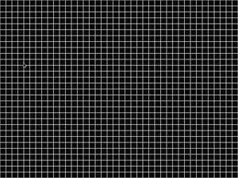

# Game of Life



## installation

```shell
$ cd 2023-sdl/
$ ./build.sh
```

## usage

```shell
$ ./a.out
```

## commands

- `q`: quit
- `space`: toggle mode [setup | running]

- **setup mode:**

    - `r`: reset game to the original state
    - `left click (on cell)` toggle cell state

## references

[Conway's Game of Life](https://en.wikipedia.org/wiki/Conway's_Game_of_Life)
